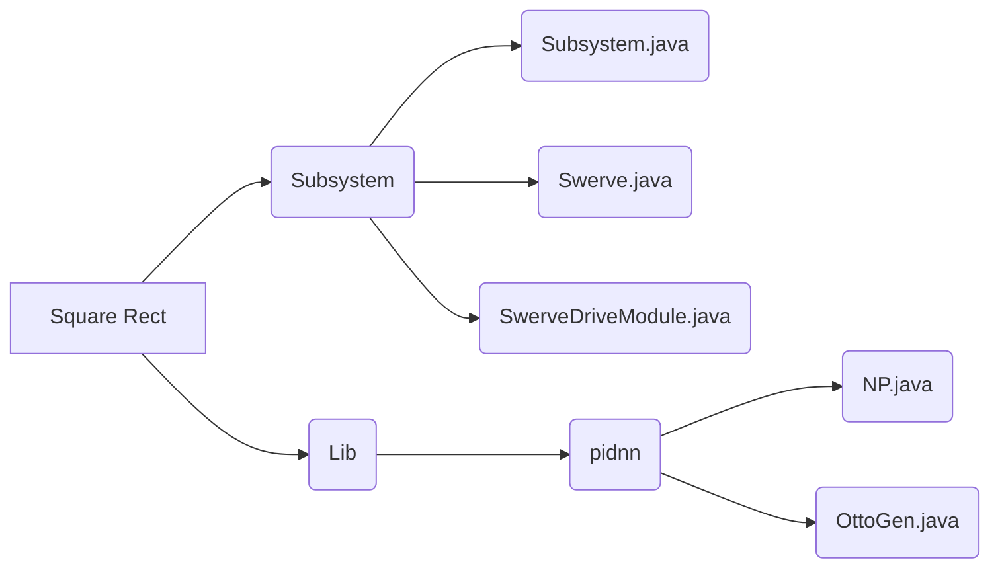

# Offseason Projects

This Repository will serve the purpose of storing the Offseason projects that OTTO wishes to complete during the offseason. This includes implementing a code style guide for better readabiity and aid in debugging along with Swerve Code for the potential swerve modules that we may have. Please refer to the TODO below to find the current status of this repository.

## TODO

* Implement and Experiment with Code Style Guide
* Implement logging software for signal analysis and issue diagnosis
* Prototype PID Neural Network for automatic and efficient tuning
* Swerve Drive Library with OTTO's PIDNN
* Automatic systems check to find issues before a match (Looking at you Thomas Priego)
* Finetuning/Improving Data transportation along the CAN bus 

## UML Diagram

To be able to prototype the potential codebase and scope out the functions needed before actually writing the code, the 1st step to program the code is to generate a UML diagram to make sure the code is as organized. This is the current UML diagram for the Offseason projects codebase: 

